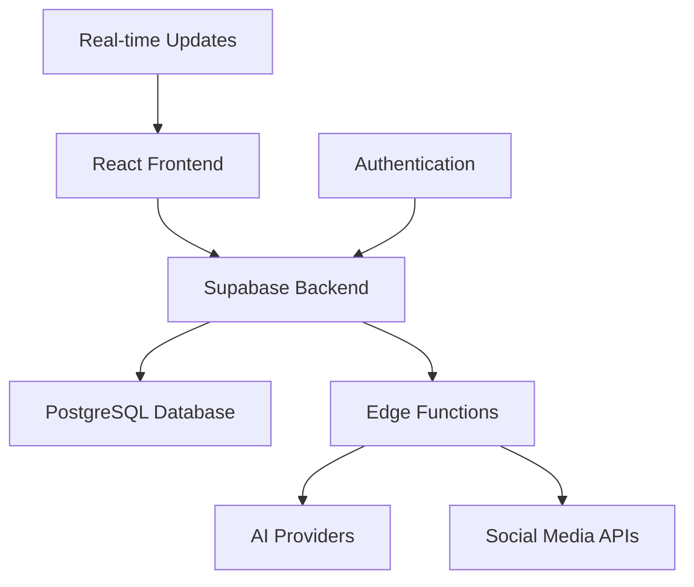

# 🚀 Social Media Automation Platform

*AI-Powered Content Generation & Multi-Platform Publishing*
  
  [](https://opensource.org/licenses/MIT)
  [](https://typescriptlang.org/)
  [](https://reactjs.org/)
  [](https://supabase.com/)
  [](https://tailwindcss.com/)
  [](https://vitejs.dev/)
  
  
  

---

## 🌟 Overview

**Social Media Automation Platform** is an AI-powered solution for social media management. It enables seamless content creation, scheduling, and publishing across multiple social media platforms with intelligent automation and monitoring.

### ✨ Key Highlights

- 🤖 **AI-Powered Content Generation** - Multiple LLM providers (Gemini, Groq)
- 🎯 **Multi-Platform Publishing** - Twitter, LinkedIn, Instagram, TikTok, YouTube
- ⏰ **Smart Scheduling** - Intelligent timing optimization
- 📊 **Analytics** - Performance tracking
- 🛡️ **Security** - Secure API management
- 🔄 **Monitoring** - Health checks and performance optimization
- 📱 **Responsive Design** - Beautiful UI across all devices

---

## 🎯 Features

### 🤖 AI Content Generation
- **Multi-LLM Support**: Integration with Gemini and Groq Llama models
- **Intelligent Prompting**: Context-aware content generation with tone and audience targeting
- **Content Optimization**: Automatic content length and style optimization for each platform

### 🌐 Platform Integrations
- **Hashnode**: Blog publishing
- **Dev.to**: Developer blog publishing
- **Twitter/X**: API integration with media upload support
- **LinkedIn**: Content publishing
- **Instagram**: Image and story publishing
- **YouTube**: Video upload and scheduling for YouTube Shorts
- **Reddit**: Community-specific content posting

### 📅 Scheduling
- **Smart Timing**: AI-powered optimal posting time recommendations
- **Bulk Scheduling**: Schedule posts across multiple platforms
- **Time Zone Management**: Global time zone support
- **Recurring Posts**: Set up repeating content schedules

### 📊 Analytics & Monitoring
- **Real-time Metrics**: Live performance tracking
- **Health Monitoring**: System health checks
- **Performance Analytics**: Insights into content performance

### 🎨 Media Generation
- **AI Image Generation**: Create visuals using multiple AI providers
- **Video Processing**: Video optimization for different platforms
- **Stock Media Integration**: Access to stock photos and videos

---

## 🏗️ Architecture

### Technology Stack



- **Frontend**: React 18 + TypeScript + Tailwind CSS
- **Backend**: Supabase (PostgreSQL + Edge Functions)
- **Authentication**: Supabase Auth
- **AI Integration**: Gemini, Groq APIs
- **Deployment**: Vercel/Netlify with global CDN

---

## 🚀 Quick Start

### Prerequisites

- Node.js 18+ and npm
- Supabase account
- API keys for desired AI providers
- Social media platform API credentials

### Installation

1. **Clone the repository**
   ```bash
   git clone https://github.com/AjayKumbham/social-media-automation.git
   cd social-media-automation
   ```

2. **Install dependencies**
   ```bash
   npm install
   ```