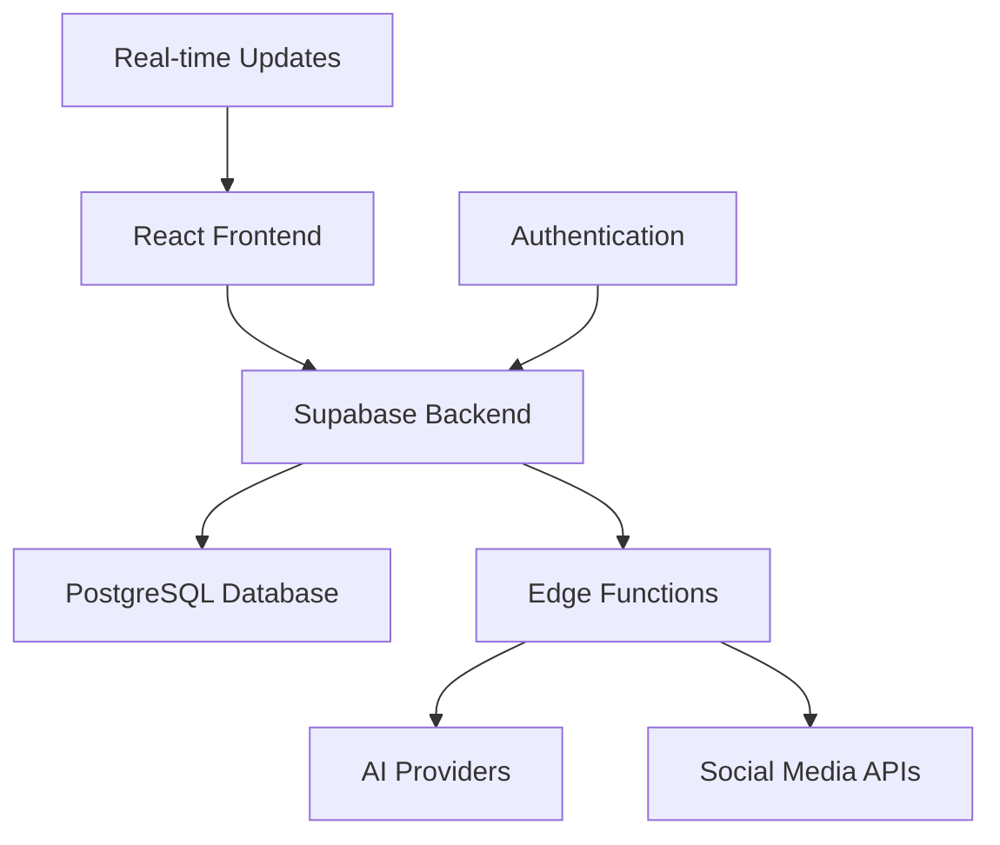

# 🚀 Social Media Automation Platform

*AI-Powered Content Generation & Multi-Platform Publishing*

[](https://opensource.org/licenses/MIT)
[](https://typescriptlang.org/)
[](https://reactjs.org/)
[](https://supabase.com/)
[](https://tailwindcss.com/)
[](https://vitejs.dev/)


---

## 🌟 Overview

**Social Media Automation Platform** is a cutting-edge, AI-powered solution that revolutionizes social media management. Built with modern technologies, it enables seamless content creation, scheduling, and publishing across multiple social media platforms with intelligent automation and robust monitoring.

### ✨ Key Highlights

- 🤖 **AI-Powered Content Generation** - Multiple LLM providers (OpenAI, Gemini, Groq)
- 🎯 **Multi-Platform Publishing** - Twitter, LinkedIn, Instagram, TikTok, YouTube
- ⏰ **Smart Scheduling** - Intelligent timing optimization
- 📊 **Advanced Analytics** - Comprehensive performance tracking
- 🛡️ **Enterprise Security** - End-to-end encryption and secure API management
- 🔄 **Real-time Monitoring** - Health checks and performance optimization
- 📱 **Responsive Design** - Beautiful UI across all devices

---

## 🎯 Features

### 🤖 AI Content Generation
- **Multi-LLM Support**: Integration with OpenAI GPT-4, Google Gemini, and Groq Llama models
- **Intelligent Prompting**: Context-aware content generation with tone and audience targeting
- **Content Optimization**: Automatic content length and style optimization for each platform
- **Fallback Systems**: Robust error handling with automatic fallback to alternative AI providers

### 🌐 Platform Integrations
- **Twitter/X**: Full API v2 integration with media upload support
- **LinkedIn**: Professional content publishing with company page support
- **Instagram**: Image and story publishing capabilities
- **TikTok**: Short-form video content automation
- **YouTube**: Video upload and scheduling for YouTube Shorts
- **Reddit**: Community-specific content posting

### 📅 Advanced Scheduling
- **Smart Timing**: AI-powered optimal posting time recommendations
- **Bulk Scheduling**: Schedule hundreds of posts across multiple platforms
- **Time Zone Management**: Global time zone support with IST optimization
- **Conflict Resolution**: Automatic scheduling conflict detection and resolution
- **Recurring Posts**: Set up repeating content schedules

### 📊 Analytics & Monitoring
- **Real-time Metrics**: Live performance tracking across all platforms
- **Health Monitoring**: System health checks with automated alerts
- **Performance Analytics**: Detailed insights into content performance
- **Error Recovery**: Intelligent error handling and automatic retry mechanisms
- **Custom Dashboards**: Personalized analytics dashboards

### 🎨 Media Generation
- **AI Image Generation**: Create stunning visuals using multiple AI providers
- **Video Processing**: Automatic video optimization for different platforms
- **Stock Media Integration**: Access to premium stock photos and videos
- **Custom Templates**: Platform-specific content templates

### 🔧 Developer Features
- **REST API**: Comprehensive API for custom integrations
- **Webhooks**: Real-time event notifications
- **SDK Support**: Official SDKs for popular programming languages
- **Custom Workflows**: Build custom automation workflows

---

## 🏗️ Architecture

### Technology Stack



- **Frontend**: React 18 + TypeScript + Tailwind CSS
- **Backend**: Supabase (PostgreSQL + Edge Functions)
- **Authentication**: Supabase Auth with RLS policies
- **Real-time**: WebSocket connections for live updates
- **AI Integration**: OpenAI, Google Gemini, Groq APIs
- **Deployment**: Vercel/Netlify with global CDN

### Core Services

| Service | Description | Technology |
|---------|-------------|------------|
| **Content Generator** | AI-powered content creation | OpenAI GPT-4, Gemini |
| **Scheduler Engine** | Intelligent post scheduling | Node.js, Cron Jobs |
| **Platform APIs** | Social media integrations | RESTful APIs |
| **Analytics Engine** | Performance tracking | PostgreSQL, Supabase |
| **Health Monitor** | System monitoring | Real-time diagnostics |
| **Error Recovery** | Fault tolerance system | Circuit breakers, Retries |

---

## 🚀 Quick Start

### Prerequisites

- Node.js 18+ and npm
- Supabase account
- API keys for desired AI providers
- Social media platform API credentials

### Installation

1. **Clone the repository**
   ```bash
   git clone https://github.com/your-username/social-media-automation.git
   cd social-media-automation
   ```

2. **Install dependencies**
   ```bash
   npm install
   ```